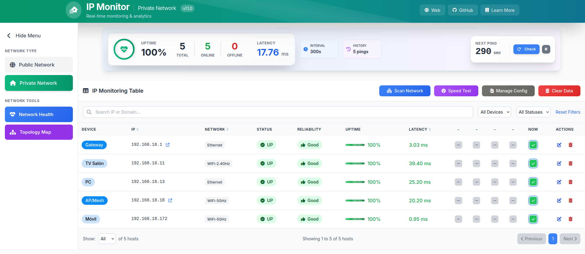

# 🌐 Monitor de IPs  
Este proyecto permite **monitorear la conectividad** a servidores desde tu red local y **corregir problemas en tu red**. Es útil para diagnosticar bloqueos de tu proveedor de Internet (ISP) y verificar la disponibilidad de estos servicios. Ademas, puedes realizar un escaneo de red local para descubrir dispositivos conectados a tu red y medir latencias y velocidades de tu red. Finalmente, puedes generar un reporte de la calidad de tu red.

**Tutorial Completo**  
👉 **[VIDEO YOUTUBE: Aprende a Monitorizar IPs](https://www.youtube.com/watch?v=B5o-eO8cS7Q)** 👈

## 📖 ¿Problemas con tu red?

**¿Tu Internet va lento? ¿Sospechas que tu operador te está limitando?** No pierdas más tiempo intentando adivinar qué está fallando.

🎯 Esta herramienta te **ayudará a**:  
✅ **Detectar bloqueos** de tu operador de Internet  
✅ **Diagnosticar problemas** de tu red local  
✅ **Optimizar tu red** para un máximo rendimiento  
✅ **Ahorrar dinero** evitando técnicos innecesarios  

**¿Necesitas más información?**  
👉 **[ACCEDE A LA GUÍA: Aprende a Monitorizar Servicios en Internet](https://negociatumente.com/guia-redes)** 👈




## ⚠️ Aviso  
- Este proyecto es solo para **uso personal y diagnóstico de red**.  
- **No** se debe **abusar** de los pings a IPs públicas para evitar tráfico innecesario.
  
## 🚀 Características  
✅ **Monitorización en tiempo real** de servidores públicos y dispositivos locales.  
✅ **Escaneo de Red Local**: Descubre dispositivos conectados a tu red.  
✅ **Test de Velocidad**: Mide tu latencia, velocidad de descarga y subida.  
✅ **Trazabilidad de Red**: Analiza los saltos de la red para identificar problemas.  
✅ **Detección de CGNAT**: Identifica si estás detrás de una NAT compartida.  
✅ **Reporte de Red**: Genera un reporte de la calidad de tu red.  

## 📁 Estructura del proyecto
```
monitor-ip/
├── index.php                       # Página principal y lógica de backend
├── menu.php                        # Menú de navegación y acciones rápidas
├── views.php                       # Vista principal del dashboard
├── conf/                           # Archivos de configuración y resultados
│   ├── config.ini                  # Configuración de IPs y servicios remotos
│   ├── config_local.ini            # Configuración de IPs locales
├── results/                        # Resultados de los pings y speedtests
│   ├── ping_results.json           # Resultados de los pings remotos
│   ├── ping_results_local.json     # Resultados de los pings locales
│   ├── speedtest_results.json      # Resultados de los speedtests
└── lib/                            # Librerías y recursos del proyecto
	├── Speedtest++/                # Librería speedtest++ para tests de velocidad
	│	└── Speedtest               # Script speedtest para tests de velocidad
	├── functions.php               # Funciones PHP reutilizables
    ├── script.js                   # Scripts JavaScript principales
    ├── network_scan.js             # Lógica de escaneo de red y speedtest
    └── styles.css                  # Estilos CSS personalizados
```
## 🔧 Tabla de funcionalidades y compatibilidad de herramientas de red

| Funcionalidad | Herramienta | Comando Linux | Comando Windows | Linux Nativo | Windows Nativo | Docker/Linux | Docker/Windows |
|-----|---------------|---------------------|---------------|-----------------|---------------|----------------|--------------|
| Test de conectividad / latencia | `iputils-ping` | `ping` | `ping` | ✔️ | ✔️ | ✔️ | ✔️ |
| Test de peticiones HTTP / APIs | `curl` | `curl` | `curl` | ✔️* | ✔️ | ✔️ | ✔️ |
| Test de consultas DNS | `dnsutils` | `dig`, `nslookup` | `nslookup` | ✔️* | ✔️ | ✔️ | ✔️ |
| Analizar los saltos de la red | `traceroute` | `traceroute` | `tracert` | ✔️* | ✔️ | ✔️ | ❌ |
| Obtener IP del Gateway/Router | `iproute2` | `ip route` | `ipconfig` | ✔️ | ✔️ | ✔️ | ✔️ |
| Test de velocidad | `Speedtest++` | `speedtest` | `speedtest.exe` | ✔️ | ✔️* | ✔️ | ✔️ |
| Escaneo de dispositivos de la red | `nmap` | `nmap` | `nmap` | ✔️* | ✔️* | ✔️ | ❌ |

**Leyenda:**
- ✔️ = Funciona
- ✔️* = Requiere instalación manual
- ❌ = No disponible (el contenedor en Windows está aislado en una subnet)						


## 🛠️ Instalación en Docker (Recomendada)

### 1️⃣ Requisitos  
⚙️ **Docker**  
⚙️ **Un navegador web**

### 2️⃣ Instalación  
**🔹Debes descargar e instalar docker en tu sistema (Linux, Windows o MacOS):**  
https://docs.docker.com/get-docker/  

### 3️⃣ Configuración
**🔹Clona el repositorio:**
```bash
docker pull ghcr.io/negociatumente/monitor-ip:v1.0.1
```

**🔹Ejecuta el contenedor:**
```bash
docker run --name monitor-ip --network host -p 80 ghcr.io/negociatumente/monitor-ip:v1.0.1
``` 

### 4️⃣ Resultados
**🔹Finalmente, abre en tu navegador la siguiente url:**  
http://localhost/monitor-ip


## 🛠️ Instalación en Linux y MacOS  

### 1️⃣ Requisitos  
⚙️ **PHP 7.4+**  
⚙️ **Servidor Apache**  
⚙️ **Un navegador web**    

### 2️⃣ Instalación  
**🔹Actualiza los repositorios:**
```bash
sudo apt update
```

**🔹Instala Apache, PHP y Git:**
```bash
sudo apt install apache2 php libapache2-mod-php git -y
```

**🔹Instala las herramientas de red necesarias:**
```bash
sudo apt install iputils-ping curl dnsutils traceroute iproute2 net-tools nmap -y
```

**🔹Clona el repositorio:**  
```bash
git clone https://github.com/negociatumente/monitor-ip.git
```

**🔹Mueve el contenido del proyecto a la carpeta del servidor web:**
```bash
sudo mv ./monitor-ip /var/www/html/monitor-ip
```

**🔹Da permisos de escritura a la carpeta de configuración:**
```bash
sudo chown -R www-data:www-data /var/www/html/monitor-ip/conf
sudo chmod -R 775 /var/www/html/monitor-ip/conf
sudo chmod -R 775 /var/www/html/monitor-ip/results
```

### 3️⃣ Configuración
**🔹Abre el archivo config.ini y modifica las IPs según los servidores que quieras monitorizar:**
```bash
cd /var/www/html/monitor-ip/conf
nano config.ini
```

### 4️⃣ Ejecución
**🔹Levanta el servidor Apache local:**
```bash
sudo systemctl start apache2
```

### 5️⃣ Resultados
**🔹Finalmente, abre en tu navegador la siguiente url:**
```bash
http://localhost/monitor-ip
```

## 🛠️ Instalación en Windows  (Funciones Limitadas)

🔹Aquí tienes un video sobre la instalación en Windows:  
https://www.tiktok.com/@negociatumente/video/7504332909923568919

### 1️⃣ Requisitos  
⚙️ **XAMPP**  https://www.apachefriends.org/es/index.html  
⚙️ **(Opcional) Nmap**  https://nmap.org/download.html  
⚙️ **(Opcional) Speedtest**  https://www.speedtest.net/apps/cli  
⚙️ **Un navegador web**    

### 2️⃣ Instalación  

**🔹Instalar XAMPP:**  
-Ejecuta el instalador y sigue los pasos.  
-Asegúrate de seleccionar Apache y PHP en la instalación.  
-Cuando termine, abre XAMPP Control Panel y presiona "Start" en Apache.  

**🔹Instalar Nmap:**  
-Descarga el instalador desde la página oficial.  
-Ejecuta el instalador y sigue los pasos.

**🔹Instalar Speedtest:**  
-Descarga el instalador desde la página oficial.  
-Pon el ejecutable speedtest.exe en la carpeta /monitor-ip/lib del proyecto 

### 3️⃣ Descargar y configurar el proyecto
**🔹Descargar el código ZIP:**  
https://github.com/negociatumente/monitor-ip

**🔹Mueve la carpeta /monitor-ip que hay dentro de la carpeta /monitor-ip-main a la carpeta de htdocs:**  
C:\xampp\htdocs\monitor-ip

### 4️⃣ Configuración
**🔹Abre el archivo config.ini y modifica las IPs según los servidores que quieras monitorizar:**  
config.ini

### 5️⃣ Resultados
**🔹Finalmente, abre en tu navegador la siguiente url:**    
http://localhost/monitor-ip
