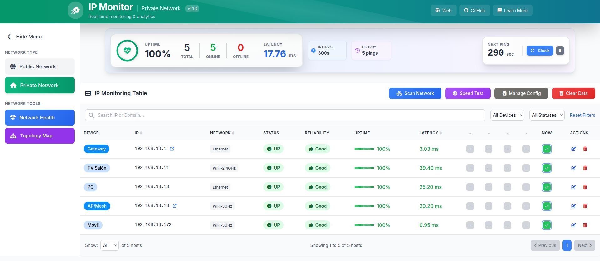

# 🌐 IP Monitor  
Este proyecto permite **monitorear la conectividad** a servidores desde tu red local y **corregir problemas en tu red**. Es útil para diagnosticar bloqueos de tu proveedor de Internet (ISP) y verificar la disponibilidad de estos servicios. Ademas, puedes realizar un escaneo de red local para descubrir dispositivos conectados a tu red y medir latencias y velocidades de tu red. Finalmente, puedes generar un reporte de la calidad de tu red.

**Tutorial Completo**  
👉 **[VIDEO YOUTUBE: Aprende a Monitorizar IPs](https://www.youtube.com/watch?v=B5o-eO8cS7Q)** 👈

## 📖 ¿Problemas con tu red?

**¿Tu Internet va lento? ¿Sospechas que tu operador te está limitando?** No pierdas más tiempo intentando adivinar qué está fallando.

🎯 Esta herramienta te **ayudará a**:  
✅ **Detectar bloqueos** de tu operador de Internet  
✅ **Diagnosticar problemas** de tu red privada
✅ **Detectar intrusos** en tu red privada
✅ **Optimizar tu red** para un máximo rendimiento  
✅ **Generar reportes** de la calidad de tu red  
✅ **Ahorrar dinero** evitando técnicos innecesarios  

**¿Necesitas más información?**  
👉 **[ACCEDE A LA GUÍA: Aprende a Monitorizar Servicios en Internet](https://negociatumente.com/guia-redes)** 👈

## 💼 ¿Necesitas una versión personalizada para tu empresa?
Si buscas una solución personalizada para tu empresa ofrezco versiones **Enterprise**:
- 🛠️ **Personalización completa** (Logo, colores y funciones específicas).

👉 **[Ponte en contacto para una consultoría](https://negociatumente.com/#contacto)**




## ⚠️ Aviso  
- Este proyecto es solo para **uso personal y diagnóstico de red**.  
- **No** se debe **abusar** de los pings a IPs públicas para evitar tráfico innecesario.
  
## 🚀 Características  
✅ **Monitorización en tiempo real** de servidores públicos y dispositivos locales.  
✅ **Escaneo de Red Local**: Descubre dispositivos conectados a tu red.  
✅ **Test de Velocidad**: Mide tu latencia, velocidad de descarga y subida.  
✅ **Trazabilidad de Red**: Analiza los saltos de la red para identificar problemas.  
✅ **Detección de CGNAT**: Identifica si estás detrás de una NAT compartida.  
✅ **Reporte de Red**: Genera un reporte de la calidad de tu red.  
✅ **Alertas de Conectividad**: Recibe notificaciones en tiempo real sobre problemas de red. 
✅ **Alertas por alta latencia**: Recibe notificaciones en tiempo real sobre latencias anormalmente altas en la red.
✅ **Alertas de Intrusos**: Recibe notificaciones en tiempo real sobre dispositivos desconocidos conectados a la red. 


## 📁 Estructura del proyecto
```
monitor-ip/
├── index.php                         # Página principal y lógica de backend
├── menu.php                          # Menú de navegación y acciones rápidas
├── views.php                         # Vista principal del dashboard
├── assets/                           # Archivos de configuración y resultados
│   ├── favicon.png                   # Icono del proyecto
│   ├── logo.png                      # Logo del proyecto
│   └── monitor-v1.0.png              # Captura de pantalla del proyecto
├── auth/                             # Archivos de configuración y resultados
│   ├── login.php                     # Página de login y autenticación
│   └── logout.php                    # Página de cierre de sesión
├── database/                         # Almacén SQLite de la aplicación
│   └── monitor.db                    # Base de datos SQLite
└── lib/                              # Librerías y recursos del proyecto
    ├── Speedtest++/                  # Librería speedtest++ para tests de velocidad
    │   └── Speedtest                 # Script speedtest para tests de velocidad
    ├── db/                           # Scripts de inicialización de SQLite
    │   ├── deployDB.php              # Inicializa y conecta monitor.db
    │   └── migrateDB.php             # Script para migrar la base de datos
    ├── functions.php                 # Funciones PHP reutilizables
    ├── network_scan.js               # Lógica de escaneo de red y speedtest
    ├── script.js                     # Scripts JavaScript principales
    └── styles.css                    # Estilos CSS personalizados

```
## 🔧 Tabla de funcionalidades y compatibilidad de herramientas de red

| Funcionalidad | Herramienta | Comando Linux | Comando Windows | Linux Nativo | Windows Nativo | Docker/Linux | Docker/Windows |
|-----|---------------|---------------------|---------------|-----------------|---------------|----------------|--------------|
| Test de conectividad / latencia | `iputils-ping` | `ping` | `ping` | ✔️ | ✔️ | ✔️ | ✔️ |
| Test de peticiones HTTP / APIs | `curl` | `curl` | `curl` | ✔️* | ✔️ | ✔️ | ✔️ |
| Test de consultas DNS | `dnsutils` | `dig`, `nslookup` | `nslookup` | ✔️* | ✔️ | ✔️ | ✔️ |
| Analizar los saltos de la red | `traceroute` | `traceroute` | `tracert` | ✔️* | ✔️ | ✔️ | ❌ |
| Obtener IP del Gateway/Router | `iproute2` | `ip route` | `ipconfig` | ✔️ | ✔️ | ✔️ | ✔️ |
| Test de velocidad | `Speedtest++` | `speedtest` | `speedtest.exe` | ✔️ | ✔️* | ✔️ | ✔️ |
| Escaneo de dispositivos de la red | `nmap` | `nmap` | `nmap` | ✔️* | ✔️* | ✔️ | ❌ |
| Alertas de Conectividad | `Telegram` | `Telegram` | `Telegram` | ✔️* | ✔️* | ✔️* | ✔️* |
| Alertas por alta latencia | `Telegram` | `Telegram` | `Telegram` | ✔️* | ✔️* | ✔️* | ✔️* |
| Alertas de Intrusos | `Telegram` | `Telegram` | `Telegram` | ✔️* | ✔️* | ✔️* | ✔️* |

    
**Leyenda:**
- ✔️ = Funciona
- ✔️* = Requiere instalación/configuración manual
- ❌ = No disponible (el contenedor en Windows está aislado en una subnet)						


## 🛠️ Instalación en Docker (Recomendada)

### 1️⃣ Requisitos  
⚙️ **Docker**  
⚙️ **Un navegador web**

### 2️⃣ Instalación  
**🔹Debes descargar e instalar docker en tu sistema (Linux, Windows o MacOS):**  
https://docs.docker.com/get-docker/  

### 3️⃣ Configuración
**🔹Se necesita indicar la versión que quiera instalar al ejecutar los siguientes comandos "monitor-ip:version". Si se quiere usar la última versión, se puede omitir el tag de la versión o indicar "monitor-ip:latest"**  

**🔹Clona el repositorio:**
```bash
docker pull ghcr.io/negociatumente/monitor-ip:lastest
```

**🔹Ejecuta el contenedor:**
```bash
docker run --name monitor-ip --network host -p 80 ghcr.io/negociatumente/monitor-ip:latest
``` 

### 4️⃣ Resultados
**🔹Finalmente, abre en tu navegador la siguiente url:**  
http://localhost/monitor-ip


## 🛠️ Instalación en Linux y MacOS  

### 1️⃣ Requisitos  
⚙️ **PHP 7.4+**  
⚙️ **Servidor Apache**  
⚙️ **Un navegador web**    

### 2️⃣ Instalación  
**🔹Actualiza los repositorios:**
```bash
sudo apt update
```

**🔹Instala Apache, PHP, SQLite y Git:**
```bash
sudo apt install apache2 php libapache2-mod-php php-sqlite3 sqlite3 git -y
```

**🔹Instala las herramientas de red necesarias:**
```bash
sudo apt install iputils-ping curl dnsutils traceroute iproute2 net-tools nmap -y
```

**🔹Clona el repositorio:**  
```bash
git clone https://github.com/negociatumente/monitor-ip.git
```

**🔹Mueve el contenido del proyecto a la carpeta del servidor web:**
```bash
sudo mv ./monitor-ip /var/www/html/monitor-ip
```

**🔹Da permisos de escritura a las carpetas necesarias:**
```bash
sudo chown -R www-data:www-data /var/www/html/monitor-ip/database
sudo chmod -R 775 /var/www/html/monitor-ip/database
```

**Nota:** El archivo con la base de datos se creará en `/var/www/html/monitor-ip/database/monitor.db`

### 3️⃣ Ejecución
**🔹Levanta el servidor Apache local:**
```bash
sudo systemctl start apache2
```

### 4️⃣ Resultados
**🔹Finalmente, abre en tu navegador la siguiente url:**
```bash
http://localhost/monitor-ip
```

## 🛠️ Instalación en Windows  (Funciones Limitadas)

🔹Aquí tienes un video sobre la instalación en Windows:  
https://www.tiktok.com/@negociatumente/video/7504332909923568919

### 1️⃣ Requisitos  
⚙️ **XAMPP**  https://www.apachefriends.org/es/index.html  
⚙️ **(Opcional) Nmap**  https://nmap.org/download.html  
⚙️ **(Opcional) Speedtest**  https://www.speedtest.net/apps/cli  
⚙️ **Un navegador web**    

### 2️⃣ Instalación  

**🔹Instalar XAMPP:**  
-Ejecuta el instalador y sigue los pasos.  
-Asegúrate de seleccionar Apache y PHP en la instalación.  
-Cuando termine, abre XAMPP Control Panel y presiona "Start" en Apache.  

**🔹Habilitar SQLite en PHP (XAMPP):**  
-Abre `php.ini` desde el panel de XAMPP o en `C:\xampp\php\php.ini`.  
-Descomenta la línea `extension=sqlite3` y `extension=pdo_sqlite` si está comentada.  
-Reinicia Apache en el panel de XAMPP.

**🔹Instalar Nmap:**  
-Descarga el instalador desde la página oficial.  
-Ejecuta el instalador y sigue los pasos.

**🔹Instalar Speedtest:**  
-Descarga el instalador desde la página oficial.  
-Pon el ejecutable speedtest.exe en la carpeta /monitor-ip/lib del proyecto 

### 3️⃣ Descargar y configurar el proyecto
**🔹Descargar el código ZIP:**  
https://github.com/negociatumente/monitor-ip

**🔹Mueve la carpeta /monitor-ip que hay dentro de la carpeta /monitor-ip-main a la carpeta de htdocs:**  
C:\xampp\htdocs\monitor-ip

### 4️⃣ Resultados
**🔹Finalmente, abre en tu navegador la siguiente url:**    
http://localhost/monitor-ip


## ⚒️ Gestionar la base de datos (Opcional)
- Instala el programa DB Browser for SQLite en tu sistema.
- Abre la aplicación y selecciona `Open Database`.
- Navega hasta ` monitor-ip\database\monitor.db` y seleccionalo.
- Explora las tablas `devices`, `ping_results`, `settings`, `services`, `telegram_alerts` y `speedtest_results`.


## 🚨 Configurar Alertas Telegram (Opcional)
### 1️⃣ Crear un bot de Telegram

Abrir este bot de Telegram:  
[https://t.me/BotFather](https://t.me/BotFather)

Enviar:
```text
/newbot
```

BotFather pedirá:
* Nombre del bot
* Username del bot (debe terminar en `bot`)

Ejemplo:
```text
IP Monitor Alerts
ip_monitor_alerts_bot
```
Después de crear el bot, BotFather mostrará algo parecido a:

```text
123456789:AAxxxxxxxxxxxxxxxxxxxxxxxxxxxx
```

Ese valor es el BOT TOKEN.
⚠️ No compartas este token.

Abrir el bot creado y pulsar:
```text
/start
```

⚠️ Este paso es obligatorio para recibir mensajes privados del bot.

---
### 2️⃣ Obtener tu Telegram User ID

Abrir este bot de Telegram:  
[https://t.me/userinfobot](https://t.me/userinfobot)

Enviar:
```text
/start
```

El bot responderá con algo parecido a:
```text
Id: 123456789
```

Ese número es tu Telegram User ID.
---
### Obtener el Chat ID de un grupo (Opcional)

Si quieres recibir alertas en un grupo:

1. Crear grupo
2. Añadir el bot
3. Dar permisos para enviar mensajes

Enviar cualquier mensaje en el grupo.
En la url del navegador, el Group Chat ID aparecerá después de `https://web.telegram.org/k/#-` y tendrá un formato parecido a:
```
-1001234567890
```
Ese valor es el Group Chat ID.

---
### 3️⃣ Configurar Telegram en el panel de IP Monitor

Abrir el panel de configuración e introducir:

| Campo                    | Valor                        |
| ------------------------ | ---------------------------- |
| Bot Token                | Token generado por BotFather |
| User/Group ID            | Tu ID personal o del grupo   |

Ejemplo:

| Campo         | Ejemplo                    |
| ------------- | -------------------------- |
| Bot Token     | `123456789:AAxxxxxxxxxxxx` |
| User ID       | `123456789`                |
| Group ID      | `-1001234567890`           |

---

### 4️⃣ Probar las alertas

Guardar configuración.

Usar:
```text
Probar conexión
```

Deberías recibir algo parecido a:

```text
Monitor-IP: prueba de alertas Telegram OK
```

---

## 🕵️ Alertas de “Intrusos” en red local (Opcional)
Si estás en la vista de red local (`?network=local`) y tienes Telegram habilitado, Monitor-IP puede hacer un escaneo con `nmap -sn` antes de los pings y avisarte cuando detecte una **IP nueva no registrada** en la tabla `devices` (red local).

- Mensaje (unificado): `Nuevo dispositivo desconocido conectado a tu red` + lista de IPs nuevas
- Anti-spam: se envía **solo una vez por IP** (queda registrado en `telegram_alerts` con `service=INTRUDER`)
- No avisa por el propio host ni por el gateway
- Se puede activar/desactivar desde **Alertas Telegram → Opciones de alerta → Avisar de intrusos (red local)**
- Si el aviso de intrusos está desactivado, no se ejecuta `nmap`
- Los intrusos detectados se guardan en SQLite (`devices`) con `type=intruder`
